# UMA-API to Home Assistant Entity Data Mapping

This document provides a comprehensive 1:1 mapping of all data flowing from the `uma-api` endpoints to Home Assistant entities in the Unraid Management Agent integration.

> **✅ Verified**: This mapping was validated against a live Unraid server running uma-api v1.2.1 on January 19, 2026.

## Table of Contents

- [Architecture Overview](#architecture-overview)
- [Collectors-Based Entity Filtering](#collectors-based-entity-filtering)
- [Data Flow Diagram](#data-flow-diagram)
- [Coordinator Data Structure](#coordinator-data-structure)
- [API Endpoint Mappings](#api-endpoint-mappings)
  - [System Info](#1-system-info)
  - [Array Status](#2-array-status)
  - [Disks](#3-disks)
  - [Containers](#4-containers)
  - [Virtual Machines](#5-virtual-machines)
  - [UPS](#6-ups)
  - [GPU](#7-gpu)
  - [Network](#8-network)
  - [Shares](#9-shares)
  - [Notifications](#10-notifications)
  - [User Scripts](#11-user-scripts)
  - [ZFS](#12-zfs)
- [Service Action Mappings](#service-action-mappings)
- [WebSocket Event Mappings](#websocket-event-mappings)

---

## Architecture Overview

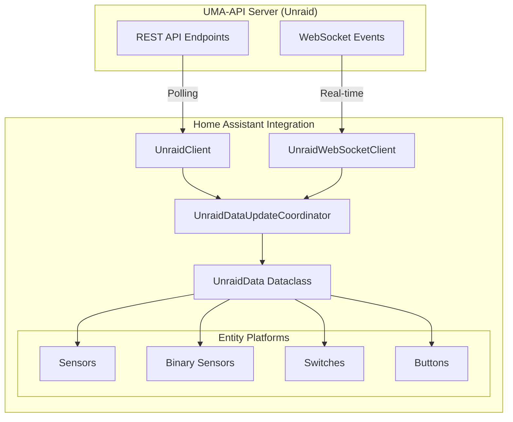

---

## Collectors-Based Entity Filtering

The integration uses the UMA-API collectors endpoint to detect which data collectors are enabled in the Unraid Management Plugin. **Entities are only created for enabled collectors.**

### How It Works

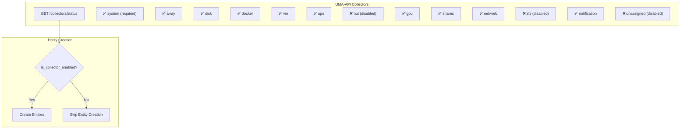

### Collector to Entity Mapping

| Collector      | Entity Types            | Entities Created When Enabled                                         |
| -------------- | ----------------------- | --------------------------------------------------------------------- |
| `system`       | Sensors                 | CPU Usage, RAM Usage, CPU Temp, Motherboard Temp, Uptime, Fan sensors |
| `array`        | Sensors, Binary Sensors | Array Usage, Parity Progress, Array Started, Parity Valid             |
| `disk`         | Sensors                 | Disk Health, Disk Usage (per physical disk)                           |
| `docker`       | Switches                | Container switches (start/stop per container)                         |
| `vm`           | Switches                | VM switches (start/stop per VM)                                       |
| `ups`          | Sensors, Binary Sensors | UPS Battery, Load, Runtime, Power, UPS Connected                      |
| `gpu`          | Sensors                 | GPU Utilization, Temperature, Power                                   |
| `network`      | Sensors, Binary Sensors | Network RX/TX, Network Interface status                               |
| `shares`       | Sensors                 | Share Usage (per share)                                               |
| `zfs`          | Sensors, Binary Sensors | ZFS Pool Usage, Health, ARC Hit Ratio, ZFS Available                  |
| `notification` | Sensors                 | Notifications count                                                   |

### Physical Disk Filtering

In addition to collector-based filtering, disks are filtered to only show **physical, installed disks**:

| Status         | Device  | Role         | Included? | Reason               |
| -------------- | ------- | ------------ | --------- | -------------------- |
| `DISK_OK`      | sdb     | parity       | ✅ Yes    | Physical parity disk |
| `DISK_OK`      | sdc     | data         | ✅ Yes    | Physical data disk   |
| `DISK_OK`      | nvme0n1 | cache        | ✅ Yes    | Physical cache SSD   |
| `DISK_OK`      | sda     | flash        | ✅ Yes    | Physical boot device |
| `DISK_NP_DSBL` | (none)  | parity2      | ❌ No     | Disabled/empty slot  |
| `DISK_OK`      | (none)  | docker_vdisk | ❌ No     | Virtual disk         |
| `DISK_OK`      | tmpfs   | log          | ❌ No     | Virtual RAM disk     |

---

## Data Flow Diagram

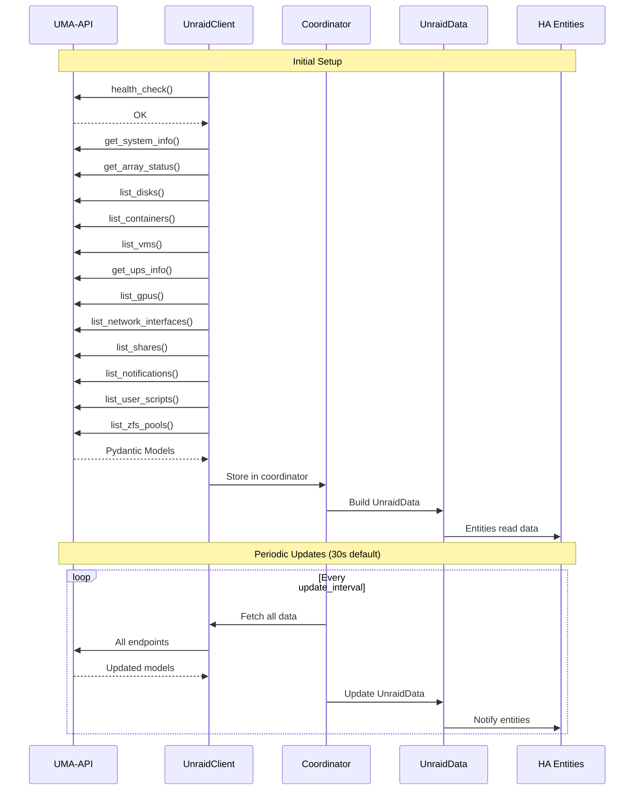

---

## Coordinator Data Structure

The `UnraidData` dataclass serves as the central data container:

```python
@dataclass
class UnraidData:
    system: SystemInfo | None              # From get_system_info()
    array: ArrayStatus | None              # From get_array_status()
    disks: list[DiskInfo] | None           # From list_disks()
    containers: list[ContainerInfo] | None # From list_containers()
    vms: list[VMInfo] | None               # From list_vms()
    ups: UPSInfo | None                    # From get_ups_info()
    gpu: list[GPUInfo] | None              # From list_gpus()
    network: list[NetworkInterface] | None # From list_network_interfaces()
    shares: list[ShareInfo] | None         # From list_shares()
    notifications: NotificationsResponse   # From list_notifications()
    user_scripts: list[UserScript] | None  # From list_user_scripts()
    zfs_pools: list[ZFSPool] | None        # From list_zfs_pools()
    zfs_datasets: list[ZFSDataset] | None  # From list_zfs_datasets()
    zfs_snapshots: list[ZFSSnapshot] | None# From list_zfs_snapshots()
    zfs_arc: ZFSArcStats | None            # From get_zfs_arc_stats()
```

---

## API Endpoint Mappings

### 1. System Info

**API Endpoint:** `client.get_system_info()` → `SystemInfo`

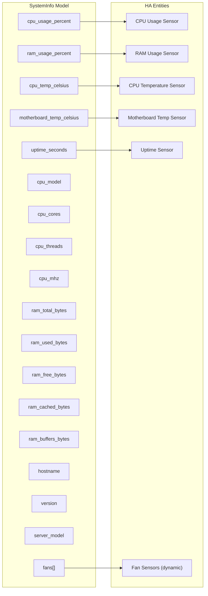

| SystemInfo Field            | Entity                  | Entity Type | State Value          | Extra Attributes                                                                                  |
| --------------------------- | ----------------------- | ----------- | -------------------- | ------------------------------------------------------------------------------------------------- |
| `cpu_usage_percent`         | CPU Usage               | Sensor      | `round(value, 1)` %  | `cpu_model`, `cpu_cores`, `cpu_threads`, `cpu_frequency`                                          |
| `ram_usage_percent`         | RAM Usage               | Sensor      | `round(value, 1)` %  | `ram_total`, `ram_used`, `ram_free`, `ram_cached`, `ram_buffers`, `ram_available`, `server_model` |
| `cpu_temp_celsius`          | CPU Temperature         | Sensor      | `round(value, 1)` °C | -                                                                                                 |
| `motherboard_temp_celsius`  | Motherboard Temperature | Sensor      | `round(value, 1)` °C | -                                                                                                 |
| `uptime_seconds`            | Uptime                  | Sensor      | Formatted duration   | `hostname`, `version`, `uptime_days`, `uptime_hours`, `uptime_minutes`, `uptime_total_seconds`    |
| `fans[].name`, `fans[].rpm` | Fan {name}              | Sensor      | RPM value            | -                                                                                                 |

---

### 2. Array Status

**API Endpoint:** `client.get_array_status()` → `ArrayStatus`

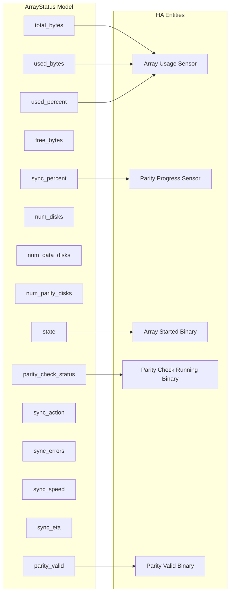

| ArrayStatus Field                          | Entity               | Entity Type             | State Value                   | Extra Attributes                                                                                               |
| ------------------------------------------ | -------------------- | ----------------------- | ----------------------------- | -------------------------------------------------------------------------------------------------------------- |
| `used_percent` or `used_bytes/total_bytes` | Array Usage          | Sensor                  | `round(value, 1)` %           | `array_state`, `num_disks`, `num_data_disks`, `num_parity_disks`, `total_capacity`, `used_space`, `free_space` |
| `sync_percent`                             | Parity Progress      | Sensor                  | `round(value, 1)` %           | `sync_action`, `sync_errors`, `sync_speed`, `estimated_completion`                                             |
| `state == "Started"`                       | Array Started        | Binary Sensor           | ON/OFF                        | -                                                                                                              |
| `parity_check_status.status`               | Parity Check Running | Binary Sensor           | ON if running/paused/checking | `parity_check_status`, `is_paused`                                                                             |
| `parity_valid == False`                    | Parity Valid         | Binary Sensor (Problem) | ON = problem                  | -                                                                                                              |

---

### 3. Disks

**API Endpoint:** `client.list_disks()` → `list[DiskInfo]`

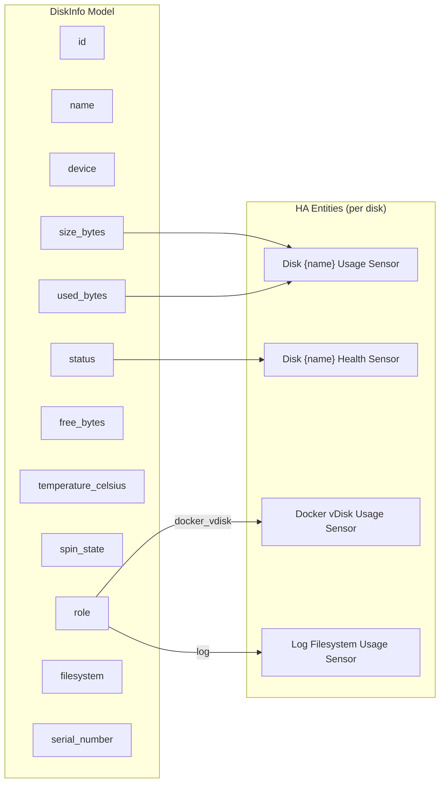

| DiskInfo Field             | Entity               | Entity Type | State Value          | Extra Attributes                                                                                    |
| -------------------------- | -------------------- | ----------- | -------------------- | --------------------------------------------------------------------------------------------------- |
| `size_bytes`, `used_bytes` | Disk {name} Usage    | Sensor      | `(used/total)*100` % | `total_size`, `used_size`, `free_size`, `device`, `filesystem`                                      |
| `status`                   | Disk {name} Health   | Sensor      | Status string        | `temperature` (from `temperature_celsius`), `spin_state`, `serial` (from `serial_number`), `device` |
| `role == "docker_vdisk"`   | Docker vDisk Usage   | Sensor      | `(used/total)*100` % | -                                                                                                   |
| `role == "log"`            | Log Filesystem Usage | Sensor      | `(used/total)*100` % | -                                                                                                   |

**Notes:**

- Parity disks (`parity`, `parity2`) are excluded from usage sensors
- Health sensors are only created for physical disks (not `docker_vdisk` or `log` roles)
- Parity disks without a device assigned skip health sensor creation

---

### 4. Containers

**API Endpoint:** `client.list_containers()` → `list[ContainerInfo]`

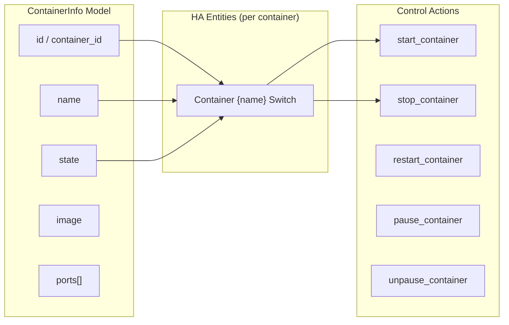

| ContainerInfo Field   | Entity           | Entity Type | State Value                | Extra Attributes                               |
| --------------------- | ---------------- | ----------- | -------------------------- | ---------------------------------------------- |
| `id`, `name`, `state` | Container {name} | Switch      | ON if `state == "running"` | `status`, `container_image`, `container_ports` |

**Control Actions (via services or switch):**

- `turn_on` → `client.start_container(container_id)`
- `turn_off` → `client.stop_container(container_id)`

---

### 5. Virtual Machines

**API Endpoint:** `client.list_vms()` → `list[VMInfo]`

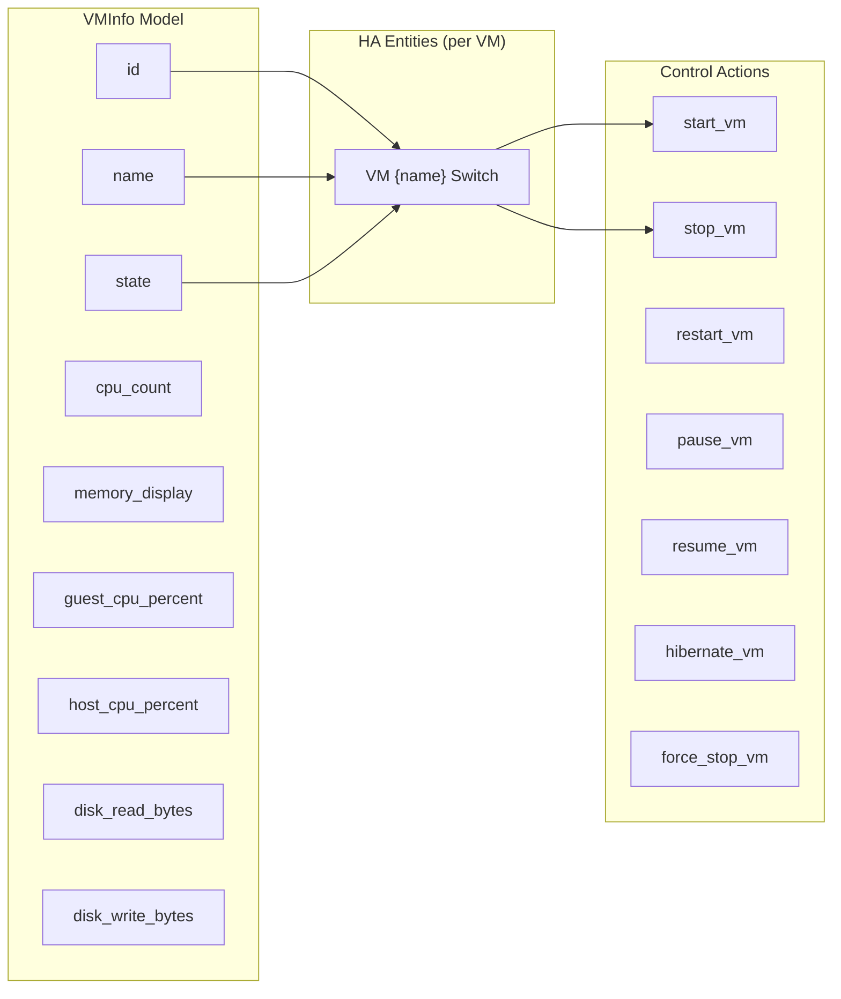

| VMInfo Field          | Entity    | Entity Type | State Value                | Extra Attributes                                                      |
| --------------------- | --------- | ----------- | -------------------------- | --------------------------------------------------------------------- |
| `id`, `name`, `state` | VM {name} | Switch      | ON if `state == "running"` | `status`, `vm_vcpus`, `guest_cpu`, `host_cpu`, `vm_memory`, `disk_io` |

**Control Actions:**

- `turn_on` → `client.start_vm(vm_id)`
- `turn_off` → `client.stop_vm(vm_id)`

---

### 6. UPS

**API Endpoint:** `client.get_ups_info()` → `UPSInfo`

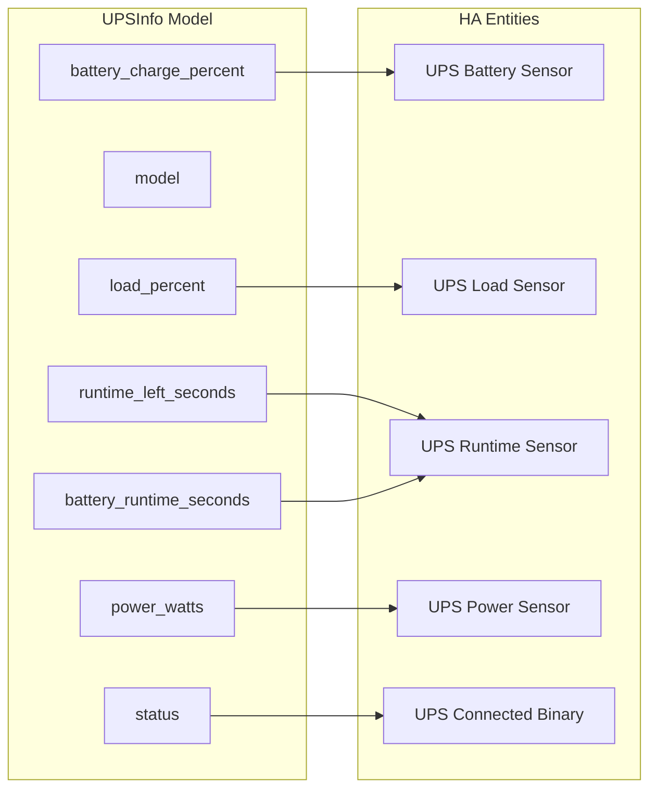

| UPSInfo Field                                       | Entity        | Entity Type   | State Value            | Extra Attributes          |
| --------------------------------------------------- | ------------- | ------------- | ---------------------- | ------------------------- |
| `battery_charge_percent`                            | UPS Battery   | Sensor        | % value                | `ups_status`, `ups_model` |
| `load_percent`                                      | UPS Load      | Sensor        | % value                | -                         |
| `runtime_left_seconds` or `battery_runtime_seconds` | UPS Runtime   | Sensor        | `runtime / 60` minutes | -                         |
| `power_watts`                                       | UPS Power     | Sensor        | Watts                  | -                         |
| `status != None && status != ""`                    | UPS Connected | Binary Sensor | ON/OFF                 | -                         |

**Notes:**

- UPS sensors only created if `ups.status` is not None
- Runtime prefers `runtime_left_seconds`, falls back to `battery_runtime_seconds`
- `energy_kwh` field is NOT available in uma-api (sensor removed)

---

### 7. GPU

**API Endpoint:** `client.list_gpus()` → `list[GPUInfo]`

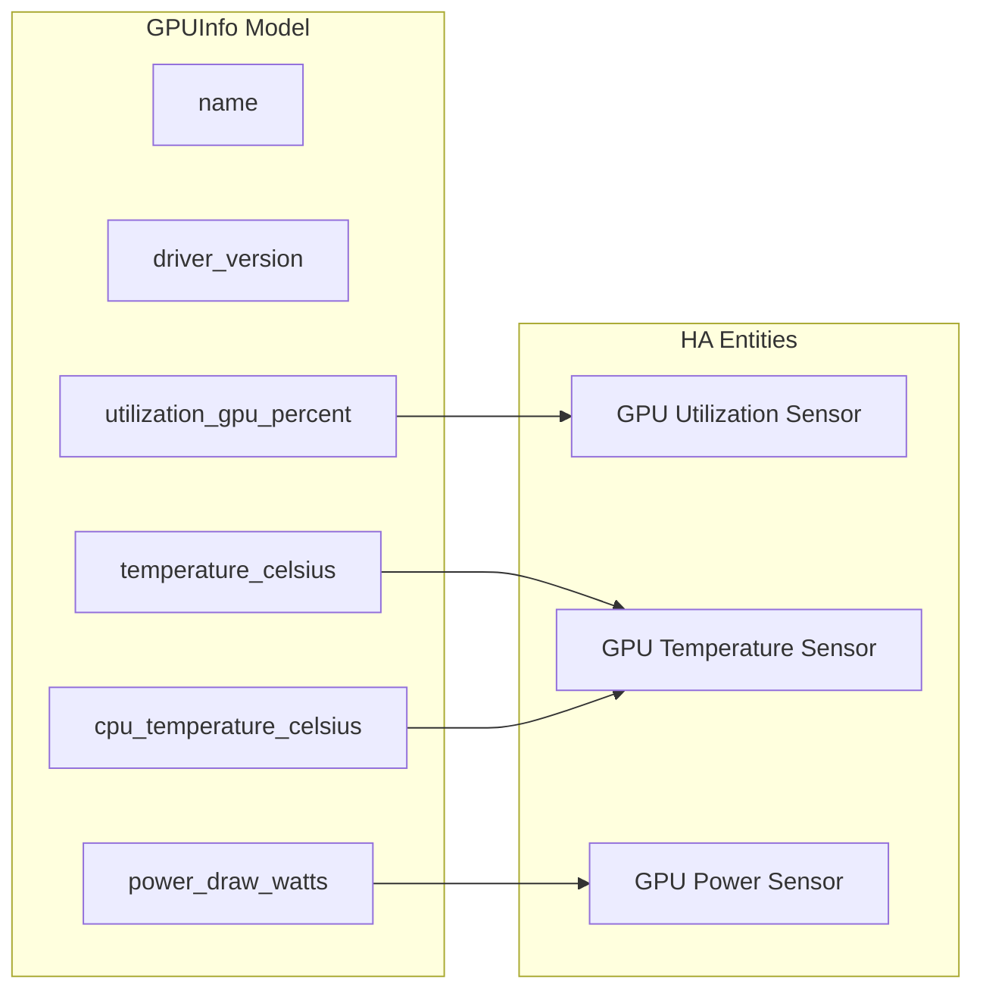

| GPUInfo Field                                      | Entity          | Entity Type | State Value | Extra Attributes                 |
| -------------------------------------------------- | --------------- | ----------- | ----------- | -------------------------------- |
| `utilization_gpu_percent`                          | GPU Utilization | Sensor      | % value     | `gpu_name`, `gpu_driver_version` |
| `temperature_celsius` or `cpu_temperature_celsius` | GPU Temperature | Sensor      | °C value    | -                                |
| `power_draw_watts`                                 | GPU Power       | Sensor      | Watts       | -                                |

**Notes:**

- GPU sensors use the first GPU in the list (`data.gpu[0]`)
- Temperature falls back to `cpu_temperature_celsius` for iGPUs when `temperature_celsius` is 0 or None
- `energy_kwh` field is NOT available in uma-api (sensor removed)

---

### 8. Network

**API Endpoint:** `client.list_network_interfaces()` → `list[NetworkInterface]`

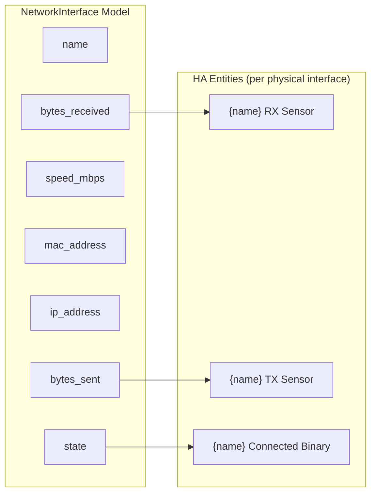

| NetworkInterface Field | Entity         | Entity Type   | State Value              | Extra Attributes                             |
| ---------------------- | -------------- | ------------- | ------------------------ | -------------------------------------------- |
| `bytes_received`       | {name} RX      | Sensor        | Bytes (total increasing) | `network_mac`, `network_ip`, `network_speed` |
| `bytes_sent`           | {name} TX      | Sensor        | Bytes (total increasing) | -                                            |
| `state == "up"`        | Network {name} | Binary Sensor | ON/OFF                   | -                                            |

**Physical Interface Detection:**
Only these patterns create entities:

- `eth\d+` (e.g., eth0, eth1)
- `wlan\d+` (e.g., wlan0)
- `bond\d+` (e.g., bond0)
- `eno\d+` (e.g., eno1)
- `enp\d+s\d+` (e.g., enp0s31f6)

---

### 9. Shares

**API Endpoint:** `client.list_shares()` → `list[ShareInfo]`

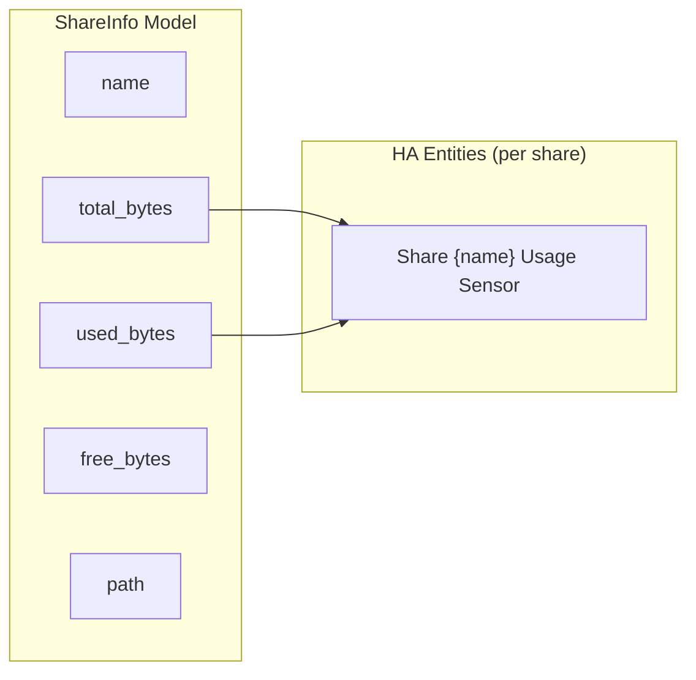

| ShareInfo Field             | Entity             | Entity Type | State Value          | Extra Attributes                               |
| --------------------------- | ------------------ | ----------- | -------------------- | ---------------------------------------------- |
| `total_bytes`, `used_bytes` | Share {name} Usage | Sensor      | `(used/total)*100` % | `total_size`, `used_size`, `free_size`, `path` |

---

### 10. Notifications

**API Endpoint:** `client.list_notifications()` → `NotificationsResponse`

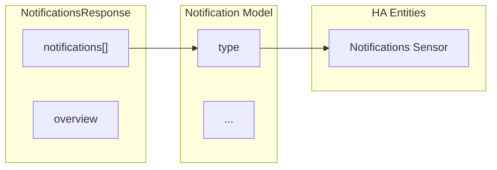

| NotificationsResponse Field | Entity        | Entity Type | State Value | Extra Attributes                          |
| --------------------------- | ------------- | ----------- | ----------- | ----------------------------------------- |
| `len(notifications)`        | Notifications | Sensor      | Count       | `unread_count` (where `type == "unread"`) |

---

### 11. User Scripts

**API Endpoint:** `client.list_user_scripts()` → `list[UserScript]`

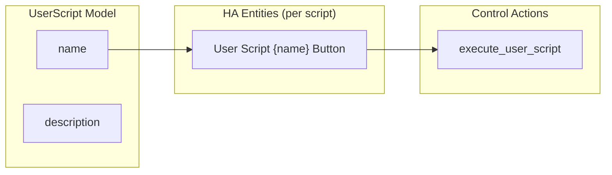

| UserScript Field      | Entity             | Entity Type | Action                             | Extra Attributes             |
| --------------------- | ------------------ | ----------- | ---------------------------------- | ---------------------------- |
| `name`, `description` | User Script {name} | Button      | `client.execute_user_script(name)` | `script_name`, `description` |

---

### 12. ZFS

**API Endpoints:**

- `client.list_zfs_pools()` → `list[ZFSPool]`
- `client.list_zfs_datasets()` → `list[ZFSDataset]`
- `client.list_zfs_snapshots()` → `list[ZFSSnapshot]`
- `client.get_zfs_arc_stats()` → `ZFSArcStats`

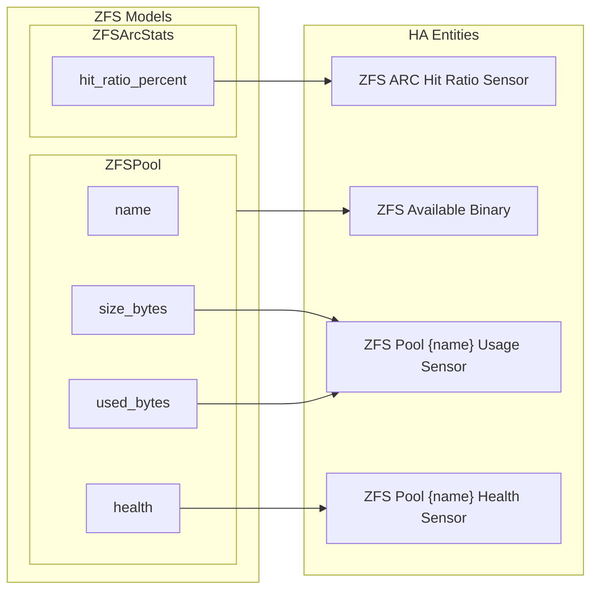

| ZFS Field                            | Entity                 | Entity Type   | State Value          | Extra Attributes |
| ------------------------------------ | ---------------------- | ------------- | -------------------- | ---------------- |
| `pool.size_bytes`, `pool.used_bytes` | ZFS Pool {name} Usage  | Sensor        | `(used/total)*100` % | -                |
| `pool.health`                        | ZFS Pool {name} Health | Sensor        | Health string        | -                |
| `arc.hit_ratio_percent`              | ZFS ARC Hit Ratio      | Sensor        | % value              | -                |
| `len(zfs_pools) > 0`                 | ZFS Available          | Binary Sensor | ON/OFF               | `pool_count`     |

---

## Service Action Mappings

### Container Services

| Service             | API Method                               | Parameters     |
| ------------------- | ---------------------------------------- | -------------- |
| `container_start`   | `client.start_container(container_id)`   | `container_id` |
| `container_stop`    | `client.stop_container(container_id)`    | `container_id` |
| `container_restart` | `client.restart_container(container_id)` | `container_id` |
| `container_pause`   | `client.pause_container(container_id)`   | `container_id` |
| `container_resume`  | `client.unpause_container(container_id)` | `container_id` |

### VM Services

| Service         | API Method                    | Parameters |
| --------------- | ----------------------------- | ---------- |
| `vm_start`      | `client.start_vm(vm_id)`      | `vm_id`    |
| `vm_stop`       | `client.stop_vm(vm_id)`       | `vm_id`    |
| `vm_restart`    | `client.restart_vm(vm_id)`    | `vm_id`    |
| `vm_pause`      | `client.pause_vm(vm_id)`      | `vm_id`    |
| `vm_resume`     | `client.resume_vm(vm_id)`     | `vm_id`    |
| `vm_hibernate`  | `client.hibernate_vm(vm_id)`  | `vm_id`    |
| `vm_force_stop` | `client.force_stop_vm(vm_id)` | `vm_id`    |

### Array Services

| Service       | API Method             | Parameters |
| ------------- | ---------------------- | ---------- |
| `array_start` | `client.start_array()` | -          |
| `array_stop`  | `client.stop_array()`  | -          |

### Parity Check Services

| Service               | API Method                     | Parameters |
| --------------------- | ------------------------------ | ---------- |
| `parity_check_start`  | `client.start_parity_check()`  | -          |
| `parity_check_stop`   | `client.stop_parity_check()`   | -          |
| `parity_check_pause`  | `client.pause_parity_check()`  | -          |
| `parity_check_resume` | `client.resume_parity_check()` | -          |

---

## WebSocket Event Mappings

The integration supports real-time updates via WebSocket. Events are mapped to coordinator data fields:

```mermaid
flowchart TB
    subgraph WS["WebSocket Events (uma_api.constants.EventType)"]
        E1[SYSTEM_UPDATE]
        E2[ARRAY_STATUS_UPDATE]
        E3[DISK_LIST_UPDATE]
        E4[UPS_STATUS_UPDATE]
        E5[GPU_UPDATE]
        E6[NETWORK_LIST_UPDATE]
        E7[CONTAINER_LIST_UPDATE]
        E8[VM_LIST_UPDATE]
        E9[SHARE_LIST_UPDATE]
        E10[NOTIFICATION_UPDATE]
        E11[ZFS_POOL_UPDATE]
        E12[ZFS_DATASET_UPDATE]
        E13[ZFS_SNAPSHOT_UPDATE]
        E14[ZFS_ARC_UPDATE]
    end

    subgraph Data["UnraidData Fields"]
        D1[system]
        D2[array]
        D3[disks]
        D4[ups]
        D5[gpu]
        D6[network]
        D7[containers]
        D8[vms]
        D9[shares]
        D10[notifications]
        D11[zfs_pools]
        D12[zfs_datasets]
        D13[zfs_snapshots]
        D14[zfs_arc]
    end

    E1 --> D1
    E2 --> D2
    E3 --> D3
    E4 --> D4
    E5 --> D5
    E6 --> D6
    E7 --> D7
    E8 --> D8
    E9 --> D9
    E10 --> D10
    E11 --> D11
    E12 --> D12
    E13 --> D13
    E14 --> D14
```

| WebSocket Event         | Target Field         | Notes                           |
| ----------------------- | -------------------- | ------------------------------- |
| `SYSTEM_UPDATE`         | `data.system`        | Full SystemInfo replacement     |
| `ARRAY_STATUS_UPDATE`   | `data.array`         | Full ArrayStatus replacement    |
| `DISK_LIST_UPDATE`      | `data.disks`         | Full list replacement           |
| `UPS_STATUS_UPDATE`     | `data.ups`           | Full UPSInfo replacement        |
| `GPU_UPDATE`            | `data.gpu`           | List or single, wrapped to list |
| `NETWORK_LIST_UPDATE`   | `data.network`       | List or single, wrapped to list |
| `CONTAINER_LIST_UPDATE` | `data.containers`    | List or single, wrapped to list |
| `VM_LIST_UPDATE`        | `data.vms`           | List or single, wrapped to list |
| `SHARE_LIST_UPDATE`     | `data.shares`        | List or single, wrapped to list |
| `NOTIFICATION_UPDATE`   | `data.notifications` | NotificationsResponse format    |
| `ZFS_POOL_UPDATE`       | `data.zfs_pools`     | List or single, wrapped to list |
| `ZFS_DATASET_UPDATE`    | `data.zfs_datasets`  | List or single, wrapped to list |
| `ZFS_SNAPSHOT_UPDATE`   | `data.zfs_snapshots` | List or single, wrapped to list |
| `ZFS_ARC_UPDATE`        | `data.zfs_arc`       | Full ZFSArcStats replacement    |

---

## Complete Entity Summary

| Platform           | Entity Count     | Dynamic | Source                                                         |
| ------------------ | ---------------- | ------- | -------------------------------------------------------------- |
| **Sensors**        | 6 core + dynamic | Yes     | SystemInfo, ArrayStatus, Disks, GPU, UPS, Network, Shares, ZFS |
| **Binary Sensors** | 5 core + dynamic | Yes     | ArrayStatus, UPS, ZFS, Network                                 |
| **Switches**       | Dynamic          | Yes     | Containers, VMs                                                |
| **Buttons**        | 4 core + dynamic | Yes     | Array control, Parity control, User Scripts                    |

### Core Sensors (6)

1. CPU Usage
2. RAM Usage
3. CPU Temperature
4. Uptime
5. Array Usage
6. Parity Progress

### Dynamic Sensors

- Motherboard Temperature (if available)
- Fan sensors (per fan)
- Disk Usage/Health (per disk)
- Docker vDisk Usage (if role exists)
- Log Filesystem Usage (if role exists)
- GPU sensors (if GPU present)
- UPS sensors (if UPS connected)
- Network RX/TX (per physical interface)
- Share Usage (per share)
- ZFS Pool Usage/Health (per pool)
- ZFS ARC Hit Ratio (if ZFS active)
- Notifications count

### Core Binary Sensors (5)

1. Array Started
2. Parity Check Running
3. Parity Valid
4. UPS Connected (if UPS present)
5. ZFS Available (if ZFS pools exist)

### Dynamic Binary Sensors

- Network {interface} Connected (per physical interface)

### Dynamic Switches

- Container {name} (per container)
- VM {name} (per VM)

### Core Buttons (4)

1. Array Start
2. Array Stop
3. Parity Check Start
4. Parity Check Stop

### Dynamic Buttons

- User Script {name} (per user script)
